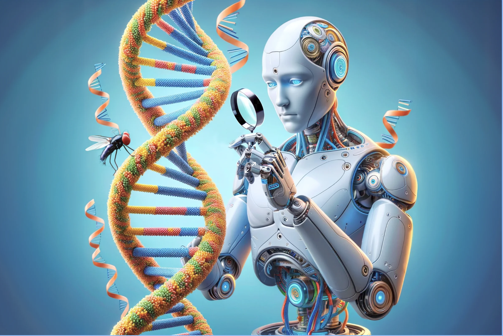

  <h1>ISPC - TSCD </h1>
 
  <h3>MODULO CIENTIFICO DE DATOS</h3>
  <h3>PROCESAMIENTO DE IMAGENES</h3>
  <h4>COHORTE 2022</h4>
  

# Profesor 

MOISES TINTE

# Integrantes

Christian Falco  
Eduardo Figueroa  
Jorge Flores  
Carlos Gimenez  
Cinthia Yael Gomez  
Monserrat Guitierrez  
Jorgelina Tissera  

# Tematica del proyecto

# Objetivos:

